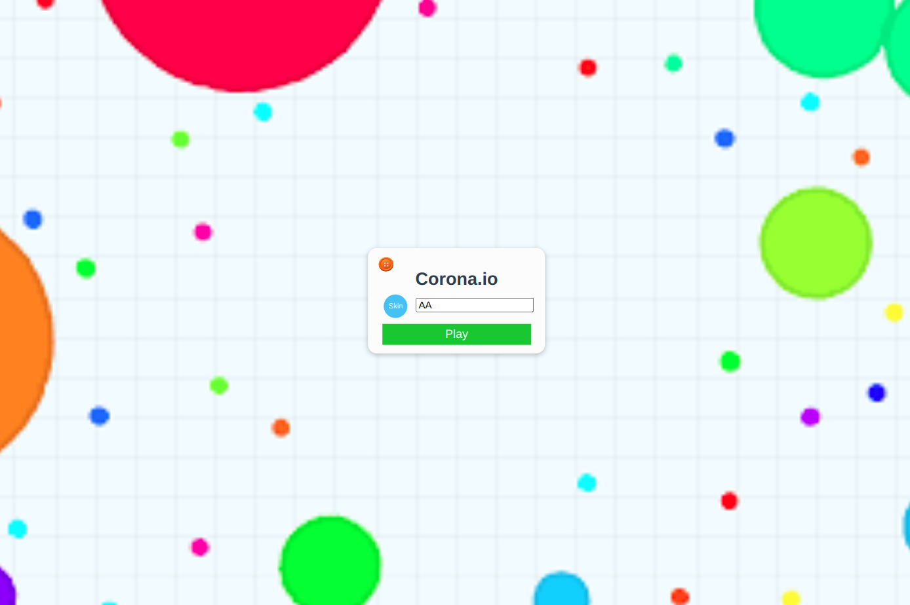
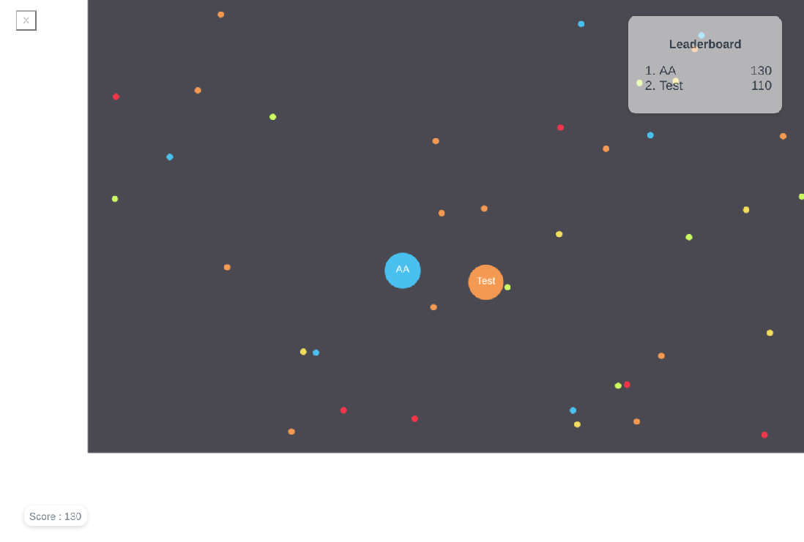

# Agar-IO-Clone

A simple Agar.io clone built with websocket on top of django and HTML5 Canvas on top of VueJS.

## How to Play
### Game Basics
- Move your mouse on the screen to move your character
- Eat food and other players in order to grow your character (food respawns every time a player eats it)
- A player's mass is the number of food particles eaten
### Objective
- Try to get fat and eat other players
### Gameplay Rules
- Players who haven't eaten yet cannot be eaten

## Requirement

### To run the program

1. django for running server
2. firebase to nest the server

### To develop the program

1. VueJS
2. Django
3. Python3
4. CanvasJS
5. VueCLI
